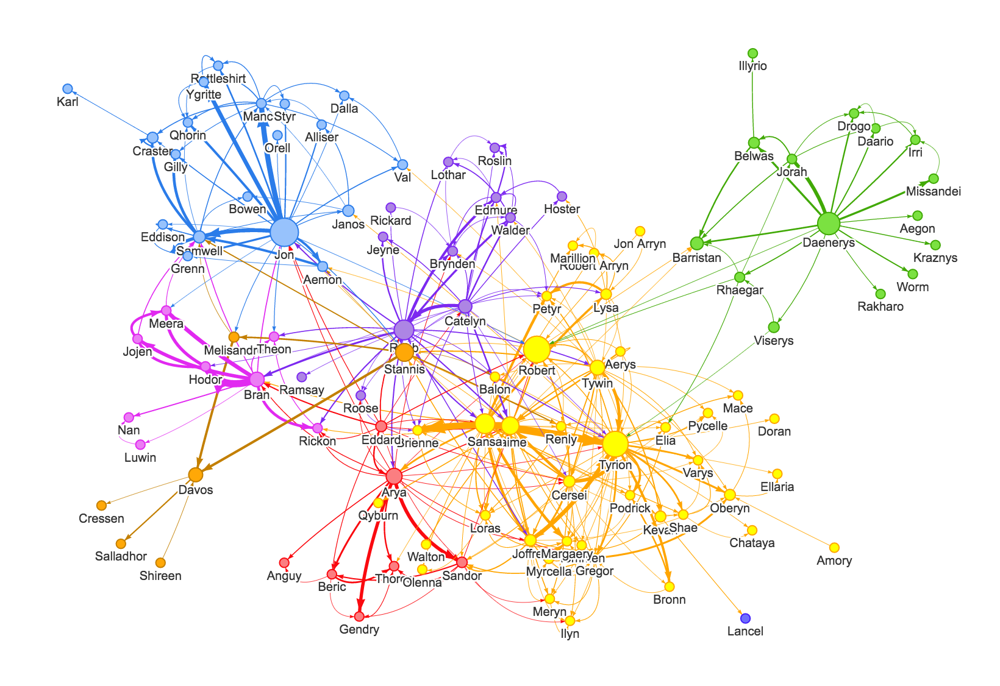
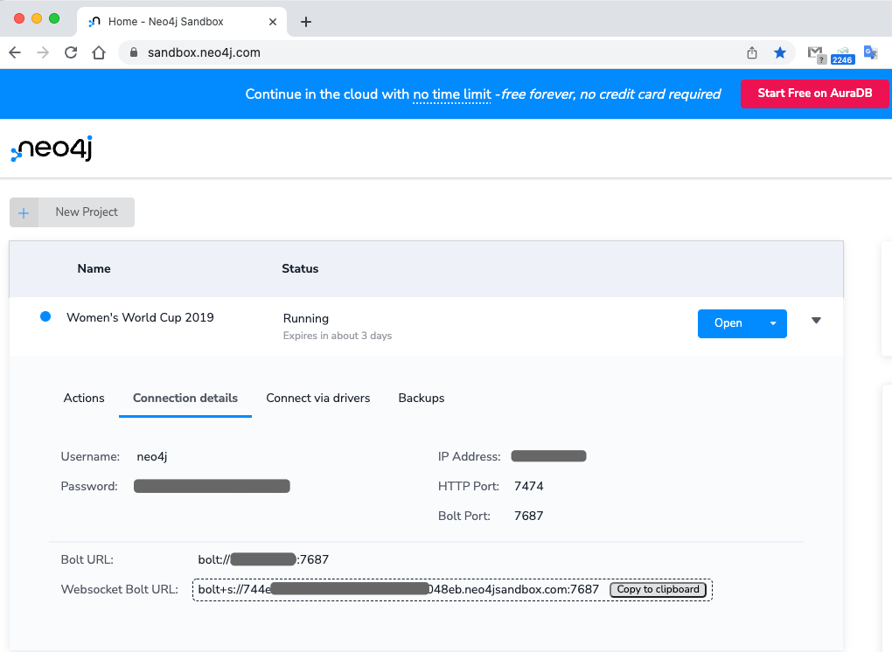
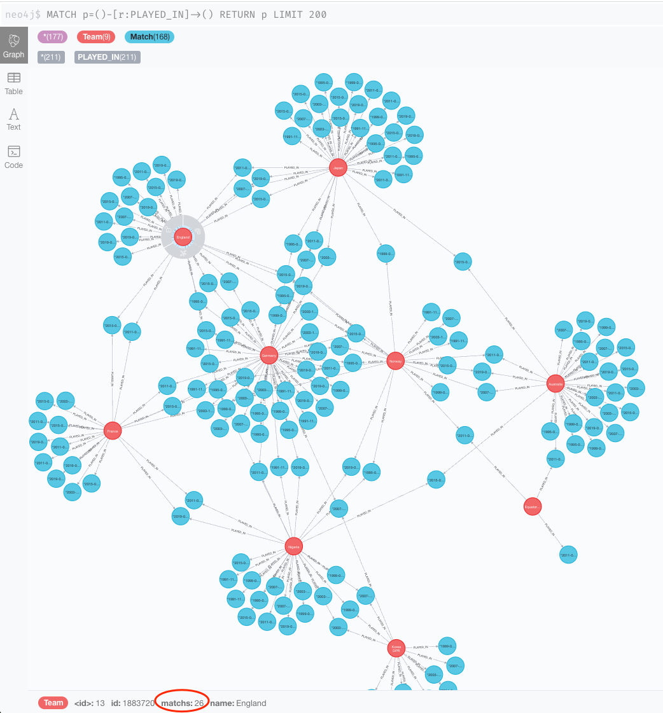

# Neo4j图数据可视化 —— 之Neovis.js篇

作者：LiuYang，Neo4j 高级技术顾问

日期：2022-07-13

## 前言

我们先来看看，使用Neovis.js可视化Neo4j图数据的效果如何。

（以下截图引自Neovis.js在Github的源代码包，地址见文末）




下面，我们将详细介绍如何实现以上案例的可视化效果。

## 准备Neo4j环境

对于初学者来说，Neo4j Sandbox简直是省时省力的学习神器。在云端免费申请一个Neo4j Sandbox的账号就可以开始您的Neo4j体验之旅了。

Neo4j Sandbox 地址：https://sandbox.neo4j.com/

本Demo使用的Sandbox为 “Women's World Cup 2019“ 数据集，启动后界面如下：



## 为数据集增加一些额外的属性，用于增强可视化效果。

为了能让数据中的Team节点有大小不同的可视化效果，我们将每个Team参加的比赛次数作为一个新的属性，写入到Team节点中。

在Sandbox界面中点击的蓝色的Open按钮，选择“Open with Browser”启动Neo4j Browser界面，运行以下Cypher语句。

```cypher
match (t:Team)-[:PLAYED_IN]-(m:Match)
with t, count(distinct m) as matchs
set t.matchs= matchs
```

Cypher语句执行结束后，提示增加了36个属性。


通过以下一条简单的Cypher语句，我们可以查询展示Team（节点）参加了（关系：PLAYED_IN）哪些Match（节点）。当选中某个Team节点后，在左下角可以看到新增的属性matchs（参加比赛的次数）的值。（数据过滤显示前200条）

```cypher
MATCH p=()-[r:PLAYED_IN]->() RETURN p LIMIT 200
```

在Neo4j Browser中显示的查询结果。



## 使用Neovis.js 可视化以上数据结果

下载Github Neovis.js 代码包（https://github.com/neo4j-contrib/neovis.js/），复制位于example目录下的twitter-trolls.html 文件，粘贴并重命名为 football.html。参考Sandbox 中的Connection details信息，修改football.html文件中Neo4j数据库连接信息。

- server_url: "bolt://3.83.25.10:7687"
- server_user:"neo4j"
- server_password: "password"

football.html 代码参考：

```html
<html>
    <head>
        <title>DataViz</title>
        <style type="text/css">
            #viz {
                width: 900px;
                height: 700px;
            }
        </style>
        <script src="../dist/neovis.js"></script>
    </head>   
    <script>
        function draw() {
            var config = {
                container_id: "viz",
                server_url: "bolt://3.83.25.10:7687",
                server_user: "neo4j",
                server_password: "password",
                labels: {
                    "Team": {
                        caption: "name",
                        size: "matchs"
                    },
                    "Match": {
                        caption: "stage"
                    }
                },
                relationships: {
                    "PLAYED_IN": {
                        caption: false,
                        thickness: "score"
                    }
                },
                initial_cypher: "MATCH p=()-[r:PLAYED_IN]->() RETURN p LIMIT 200"
            }

            var viz = new NeoVis.default(config);
            viz.render();
        }
    </script>
    <body onload="draw()">
        <div id="viz"></div>
    </body>
</html>
```

本地直接用浏览器运行football.html 的可视化效果：


在该可视化展示中，Team节点的大小通过matchs属性值来渲染，Team和Match的关系“PLAYED_IN”连线的粗细则由score属性值来渲染。更多复杂的可视化设置请参考代码包中的其他示例。

## 附录

Neovis.js 示例包在Github的地址：https://github.com/neo4j-contrib/neovis.js/

